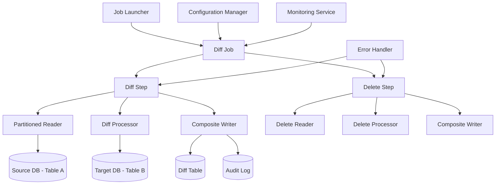

# Design Document

## Overview

这个设计文档描述了Spring Batch数据差异处理应用的优化架构。系统将采用现代Spring Boot最佳实践，实现高性能、可维护和可扩展的批处理解决方案。

## Architecture

### 整体架构



### 分层架构

1. **配置层 (Configuration Layer)**
   - 批处理作业配置
   - 数据源配置
   - 分区策略配置

2. **服务层 (Service Layer)**
   - 数据比较服务
   - 审计服务
   - 监控服务

3. **数据访问层 (Data Access Layer)**
   - Repository接口
   - 数据库操作抽象

4. **基础设施层 (Infrastructure Layer)**
   - 错误处理
   - 日志记录
   - 性能监控

## Components and Interfaces

### 核心组件

#### 1. Enhanced Batch Configuration
```java
@Configuration
@EnableBatchProcessing
public class OptimizedBatchConfig {
    // 支持多数据源配置
    // 分区处理配置
    // 性能优化配置
}
```

#### 2. Data Comparison Service
```java
public interface DataComparisonService {
    ComparisonResult compareRecords(DiffRecord source, DiffRecord target);
    List<DiffRecord> findChangedRecords(List<String> ids);
}
```

#### 3. Audit Service
```java
public interface AuditService {
    void logOperation(String operation, String recordId, String details);
    void logJobExecution(JobExecution execution);
}
```

#### 4. Enhanced Processors
- **DiffProcessor**: 优化的数据比较处理器
- **DeleteProcessor**: 优化的删除处理器
- **ValidationProcessor**: 数据验证处理器

#### 5. Composite Writers
- **DatabaseWriter**: 数据库写入操作
- **AuditWriter**: 审计日志写入
- **MetricsWriter**: 性能指标记录

### 接口设计

#### Repository Layer
```java
public interface DiffRecordRepository {
    List<DiffRecord> findByPartition(int partitionIndex, int partitionCount);
    Optional<DiffRecord> findById(String id);
    void saveAll(List<DiffRecord> records);
}
```

#### Service Layer
```java
public interface BatchJobService {
    JobExecution runDiffJob(JobParameters parameters);
    JobExecutionStatus getJobStatus(Long executionId);
    void stopJob(Long executionId);
}
```

## Data Models

### Enhanced DiffRecord
```java
@Entity
@Table(name = "diff_records")
public class DiffRecord {
    @Id
    private String id;
    private String col1;
    private String col2;
    
    @Enumerated(EnumType.STRING)
    private DiffType diffType;
    
    @CreationTimestamp
    private LocalDateTime createdAt;
    
    @UpdateTimestamp
    private LocalDateTime updatedAt;
    
    private String checksum; // 用于快速比较
}
```

### DiffType Enum
```java
public enum DiffType {
    INSERT("新增"),
    UPDATE("更新"), 
    DELETE("删除"),
    NONE("无变化");
}
```

### Audit Log Model
```java
@Entity
@Table(name = "batch_audit_log")
public class BatchAuditLog {
    @Id
    @GeneratedValue
    private Long id;
    
    private String jobName;
    private Long jobExecutionId;
    private String operation;
    private String recordId;
    private String details;
    
    @CreationTimestamp
    private LocalDateTime timestamp;
}
```

### Job Metrics Model
```java
@Entity
@Table(name = "job_metrics")
public class JobMetrics {
    @Id
    @GeneratedValue
    private Long id;
    
    private Long jobExecutionId;
    private String metricName;
    private Double metricValue;
    private String unit;
    
    @CreationTimestamp
    private LocalDateTime recordedAt;
}
```

## Error Handling

### 异常处理策略

1. **Retry Policy**
   - 数据库连接异常：最多重试3次
   - 临时网络问题：指数退避重试
   - 数据验证错误：跳过并记录

2. **Skip Policy**
   - 数据格式错误：跳过记录并记录到错误日志
   - 业务规则违反：跳过并发送告警

3. **Error Logging**
   - 结构化错误日志
   - 错误分类和统计
   - 自动告警机制

### 错误处理组件

```java
@Component
public class BatchErrorHandler implements SkipListener<DiffRecord, DiffRecord> {
    @Override
    public void onSkipInRead(Throwable t);
    
    @Override
    public void onSkipInWrite(DiffRecord item, Throwable t);
    
    @Override
    public void onSkipInProcess(DiffRecord item, Throwable t);
}
```

## Testing Strategy

### 测试层次

1. **单元测试 (Unit Tests)**
   - 所有Processor组件
   - Service层业务逻辑
   - Repository数据访问
   - 工具类和辅助方法

2. **集成测试 (Integration Tests)**
   - 完整的批处理作业流程
   - 数据库集成测试
   - 多数据源配置测试

3. **性能测试 (Performance Tests)**
   - 大数据量处理测试
   - 并发处理能力测试
   - 内存使用优化验证

4. **端到端测试 (E2E Tests)**
   - 完整业务场景验证
   - 错误恢复测试
   - 监控和告警测试

### 测试工具和框架

- **JUnit 5**: 单元测试框架
- **Testcontainers**: 集成测试数据库
- **Spring Batch Test**: 批处理测试支持
- **WireMock**: 外部服务模拟
- **JMH**: 性能基准测试

### 测试数据管理

```java
@TestConfiguration
public class TestDataConfig {
    @Bean
    @Primary
    public DataSource testDataSource() {
        // H2内存数据库配置
    }
    
    @Bean
    public TestDataInitializer testDataInitializer() {
        // 测试数据初始化
    }
}
```

## Performance Optimizations

### 数据库优化

1. **连接池配置**
   - HikariCP连接池优化
   - 连接数和超时配置
   - 连接泄漏检测

2. **查询优化**
   - 批量查询操作
   - 索引优化建议
   - 分页查询策略

3. **事务管理**
   - 合适的事务边界
   - 读写分离支持
   - 死锁检测和处理

### 内存优化

1. **Chunk Size调优**
   - 基于可用内存动态调整
   - 不同数据类型的优化策略

2. **对象池化**
   - 重用频繁创建的对象
   - 减少GC压力

### 并发优化

1. **分区处理**
   - 智能分区策略
   - 负载均衡
   - 动态分区调整

2. **异步处理**
   - 非阻塞I/O操作
   - 异步写入优化

## Monitoring and Observability

### 监控指标

1. **作业级别指标**
   - 执行时间
   - 处理记录数
   - 错误率
   - 吞吐量

2. **系统级别指标**
   - CPU使用率
   - 内存使用情况
   - 数据库连接数
   - 网络I/O

### 日志策略

1. **结构化日志**
   - JSON格式日志
   - 统一日志格式
   - 关键字段标准化

2. **日志级别管理**
   - 动态日志级别调整
   - 环境特定配置
   - 敏感信息脱敏

### 告警机制

1. **作业失败告警**
   - 邮件通知
   - Slack集成
   - 钉钉机器人

2. **性能告警**
   - 执行时间超阈值
   - 错误率过高
   - 资源使用异常

## Configuration Management

### 环境配置

1. **多环境支持**
   - development.yml
   - staging.yml  
   - production.yml

2. **配置外部化**
   - 环境变量支持
   - 配置中心集成
   - 敏感信息加密

### 功能开关

```yaml
features:
  partitioning:
    enabled: true
    partition-size: 1000
  monitoring:
    enabled: true
    metrics-interval: 30s
  audit:
    enabled: true
    detailed-logging: false
```

## Security Considerations

### 数据安全

1. **数据库连接安全**
   - 连接字符串加密
   - 最小权限原则
   - 连接超时配置

2. **敏感数据处理**
   - 数据脱敏
   - 审计日志安全
   - 传输加密

### 访问控制

1. **作业执行权限**
   - 基于角色的访问控制
   - API安全认证
   - 操作审计

## Deployment Strategy

### 容器化部署

```dockerfile
FROM openjdk:17-jre-slim
COPY target/spring-batch-diff-job.jar app.jar
ENTRYPOINT ["java", "-jar", "/app.jar"]
```

### 配置管理

```yaml
# docker-compose.yml
version: '3.8'
services:
  batch-app:
    image: spring-batch-diff-job:latest
    environment:
      - SPRING_PROFILES_ACTIVE=production
      - DB_HOST=mysql
      - DB_PORT=3306
    depends_on:
      - mysql
```

### 健康检查

```java
@Component
public class BatchHealthIndicator implements HealthIndicator {
    @Override
    public Health health() {
        // 检查数据库连接
        // 检查作业状态
        // 返回健康状态
    }
}
```